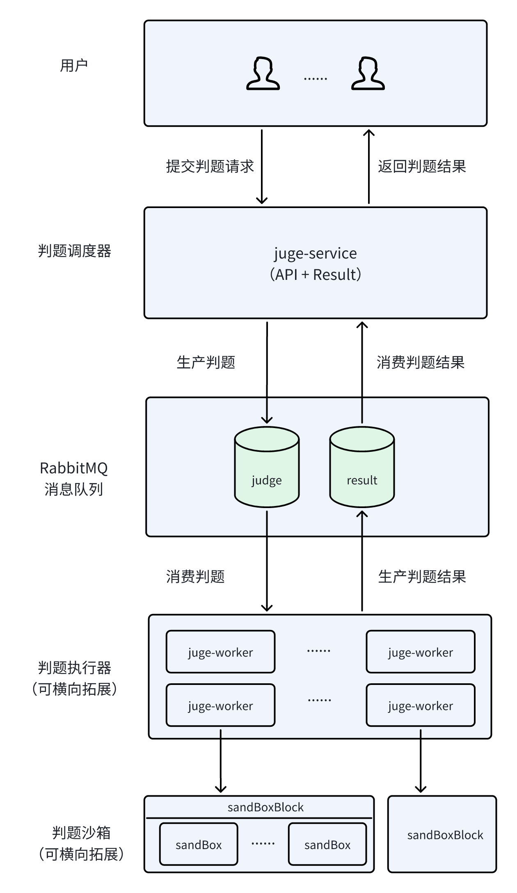

# Online Judge 在线判题系统

一个基于微服务架构的高性能在线判题系统，支持Java代码的编译、执行和判题。

## 📋 项目简介

Online Judge 是一个分布式在线判题系统，采用微服务架构设计，支持代码提交、编译、执行和结果判定的完整流程。系统具有高并发、高可用、可扩展的特点，适用于编程竞赛、在线教育等场景。

## 🏗️ 系统架构



### 架构组件

- **Judge Service**: 判题服务，负责接收代码提交请求和返回判题结果
- **Judge Worker**: 判题工作节点，负责代码编译、执行和判题
- **RabbitMQ**: 消息队列，用于服务间异步通信
- **Redis**: 缓存服务，用于存储判题结果和临时数据
- **Docker**: 容器化执行环境，确保代码执行的安全性和隔离性

## 🛠️ 技术栈

### 后端技术
- **Java 17**: 主要开发语言
- **Spring Boot 2.7.18**: 微服务框架
- **Spring AMQP**: RabbitMQ消息队列集成
- **Spring Data Redis**: Redis缓存集成
- **Docker Java API**: Docker容器管理
- **Maven**: 项目构建工具

### 中间件
- **RabbitMQ 3**: 消息队列服务
- **Redis 7**: 缓存数据库
- **Docker**: 容器化执行环境

### 开发工具
- **JMeter**: 性能测试工具

## 📁 项目结构

```
oneline-judge/
├── common-model/           # 公共模型模块
│   ├── src/main/java/cn/icongyou/common/
│   │   ├── CodeExecutionRequest.java    # 代码执行请求
│   │   ├── CodeExecutionResult.java     # 代码执行结果
│   │   └── JudgeStatus.java             # 判题状态枚举
│   └── pom.xml
├── judge-service/          # 判题服务模块
│   ├── src/main/java/cn/icongyou/
│   │   ├── controller/
│   │   │   └── JudgeController.java     # REST API控制器
│   │   ├── service/
│   │   │   └── ResultService.java       # 结果服务
│   │   ├── messaging/
│   │   │   └── JudgeProducer.java       # 消息生产者
│   │   ├── listener/
│   │   │   └── CodeExecutionResultConsumer.java  # 结果消费者
│   │   ├── config/
│   │   │   ├── RabbitMQConfig.java      # RabbitMQ配置
│   │   │   └── RedisConfig.java         # Redis配置
│   │   └── JudgeServiceApplication.java # 服务启动类
│   ├── src/main/resources/
│   │   └── application.yml              # 配置文件
│   └── pom.xml
├── judge-worker/           # 判题工作节点模块
│   ├── src/main/java/cn/icongyou/
│   │   ├── executor/
│   │   │   ├── JavaCodeExecutor.java    # Java代码执行器
│   │   │   └── DockerContainerPool.java # Docker容器池
│   │   ├── listener/
│   │   │   └── JudgeConsumer.java       # 判题任务消费者
│   │   ├── messaging/
│   │   │   └── JudgeResultProducer.java # 结果生产者
│   │   ├── config/
│   │   │   └── RabbitMQConfig.java      # RabbitMQ配置
│   │   └── JudgeWorkerApplication.java  # 工作节点启动类
│   ├── src/main/resources/
│   │   └── application.yml              # 配置文件
│   └── pom.xml
├── docker-compose.yml      # Docker编排文件
├── jemeter测试计划.jmx      # JMeter性能测试计划
├── 系统结构图.png          # 系统架构图
└── pom.xml                 # 父项目POM文件
```

## 🚀 快速开始

### 环境要求

- Java 17+
- Maven 3.6+
- Docker & Docker Compose
- 至少 4GB 可用内存

### 1. 克隆项目

```bash
git clone <repository-url>
cd oneline-judge
```

### 2. 启动依赖服务

```bash
docker-compose up -d
```

这将启动以下服务：
- RabbitMQ (端口: 5672, 管理界面: 15672)
- Redis (端口: 6379)

### 3. 编译项目

```bash
mvn clean compile
```

### 4. 启动服务

#### 启动判题服务
```bash
cd judge-service
mvn spring-boot:run
```

#### 启动判题工作节点
```bash
cd judge-worker
mvn spring-boot:run
```

### 5. 验证服务

服务启动后，可以通过以下方式验证：

- 判题服务: http://localhost:8080
- RabbitMQ管理界面: http://localhost:15672 (用户名/密码: guest/guest)

## 📖 API 文档

### 提交代码

```http
POST /judge/submit
Content-Type: application/json

{
  "sourceCode": "public class Main { public static void main(String[] args) { System.out.println(\"Hello World\"); } }",
  "stdin": "optional input data",
  "timeLimitMs": 5000,
  "memoryLimitMb": 512
}
```

响应：
```json
{
  "message": "Submission accepted: <submission-id>"
}
```

### 获取判题结果

```http
GET /judge/result/{submissionId}
```

响应：
```json
{
  "submissionId": "uuid",
  "status": "ACCEPTED",
  "stdout": "Hello World",
  "stderr": "",
  "exitCode": 0,
  "executionTimeMs": 150,
  "memoryUsageKb": 1024
}
```

## 🔧 配置说明

### 判题服务配置 (judge-service/application.yml)

```yaml
spring:
  rabbitmq:
    host: localhost
    port: 5672
    username: guest
    password: guest
  
  redis:
    host: localhost
    port: 6379
    database: 0

server:
  port: 8080

app:
  result-cache-ttl: 3600        # 结果缓存时间（秒）
  max-concurrent-requests: 1000 # 最大并发请求数
  request-queue-size: 5000      # 请求队列大小
```

### 判题工作节点配置 (judge-worker/application.yml)

```yaml
spring:
  rabbitmq:
    host: localhost
    port: 5672
    username: guest
    password: guest

app:
  docker:
    image: openjdk:17-jdk-slim  # 执行环境镜像
    max-containers: 10          # 最大容器数
    container-timeout: 30000    # 容器超时时间（毫秒）
```

## 🧪 性能测试

项目包含JMeter测试计划，可用于性能测试：

```bash
jmeter -n -t jemeter测试计划.jmx -l results.jtl -e -o report
```

## 🔒 安全特性

- **容器隔离**: 使用Docker容器执行代码，确保系统安全
- **资源限制**: 支持CPU时间、内存使用量限制
- **超时控制**: 防止恶意代码无限循环
- **沙箱环境**: 代码在受限环境中执行

## 📊 监控指标

系统提供以下监控指标：

- 代码执行成功率
- 平均执行时间
- 并发处理能力
- 容器池使用率
- 队列积压情况

## 🤝 贡献指南

1. Fork 本仓库
2. 创建特性分支 (`git checkout -b feature/AmazingFeature`)
3. 提交更改 (`git commit -m 'Add some AmazingFeature'`)
4. 推送到分支 (`git push origin feature/AmazingFeature`)
5. 开启 Pull Request

## 📄 许可证

本项目采用 MIT 许可证 - 查看 [LICENSE](LICENSE) 文件了解详情。

## 👥 作者

- **JiangYang** - 初始工作

## 🙏 致谢

感谢所有为这个项目做出贡献的开发者和用户。

---

如有问题或建议，请提交 [Issue](https://github.com/your-username/oneline-judge/issues)。